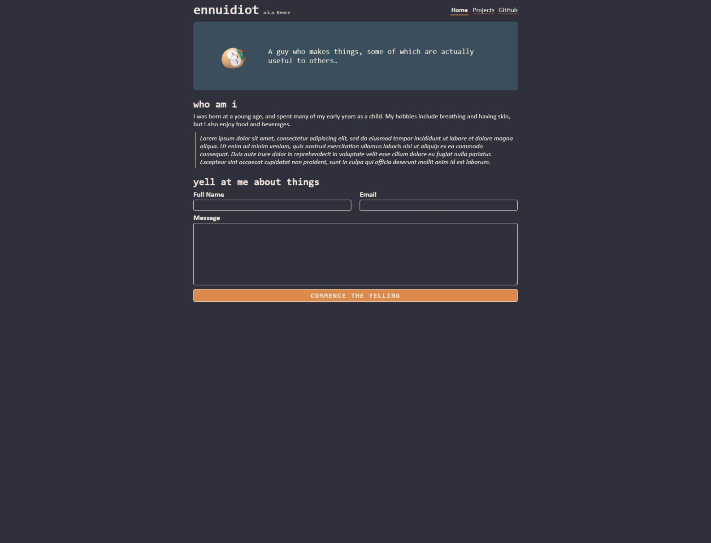
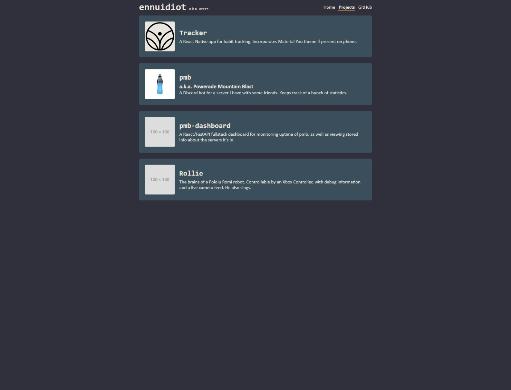
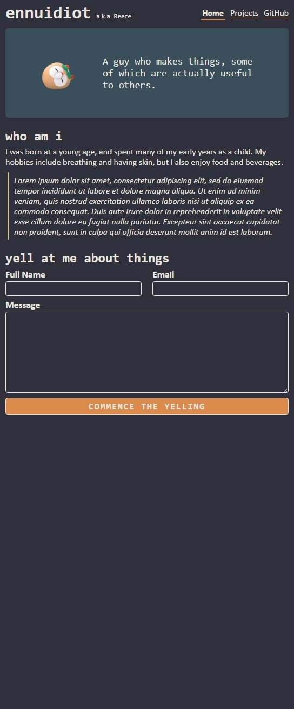
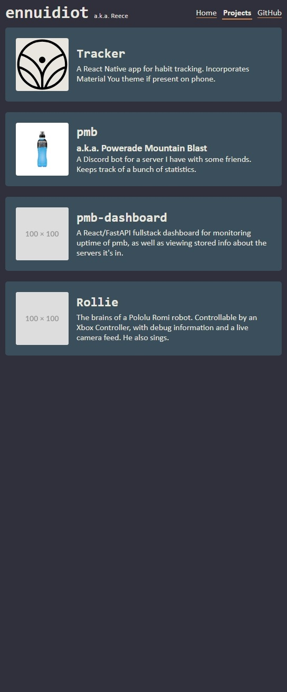

#  ennuidiot - Portfolio Task
​
[My portfolio site](https://ennuidiot.github.io/)
​
## Project Requirements

### Content
 Add a short paragraph describing the features below. What aesthetic and technical choices did you make? 
- [x] At least one profile picture[^1] 
- [x] Biography (at least 100 words)[^2]
- [x] Functional Contact Form[^3]
- [x] "Projects" section 
- [x] Links to external sites, e.g. GitHub and LinkedIn.

[^1]: If Rowlet counts
[^2]: My biography is jokey/lorem ipsum-y but you should do a serious one
[^3]: Might not be an actual requirement, hold please
​
### Technical
 Add a short paragraph describing the features below. What strategies or design decisions did you work from? 
- [x] At least 2 web pages.
- [x] Version controlled with Git
- [x] Deployed on GitHub pages.
- [x] Implements responsive design principles.
- [x] Uses semantic HTML.

### Bonus (optional)
 Add a short paragraph describing the features below, if you included any. 
- [x] Different styles for active, hover and focus states.
- [x] Include JavaScript to add some dynamic elements to your site. (Extra tricky!)

#### Different Styles and JavaScript

The navigation links become bold, and gain extra padding if they're hovered over, or if the current page matches that 
link. The submit button for the contact form also vibrates violently on hover, and when someone's currently clicking on
it, it changes the text.
​
### Screenshots
The page content looks pretty much the same no matter the page width. IMO this would be acceptable for your pages, but
I highly encourage you to go above and beyond if possible - have your content render differently for a variety of screen
sizes.

####  `index.html`, >800-ish pixels

####  `projects.html`, >800-ish pixels

####  `index.html`, <800-ish pixels

####  `projects.html`, <800-ish pixels

